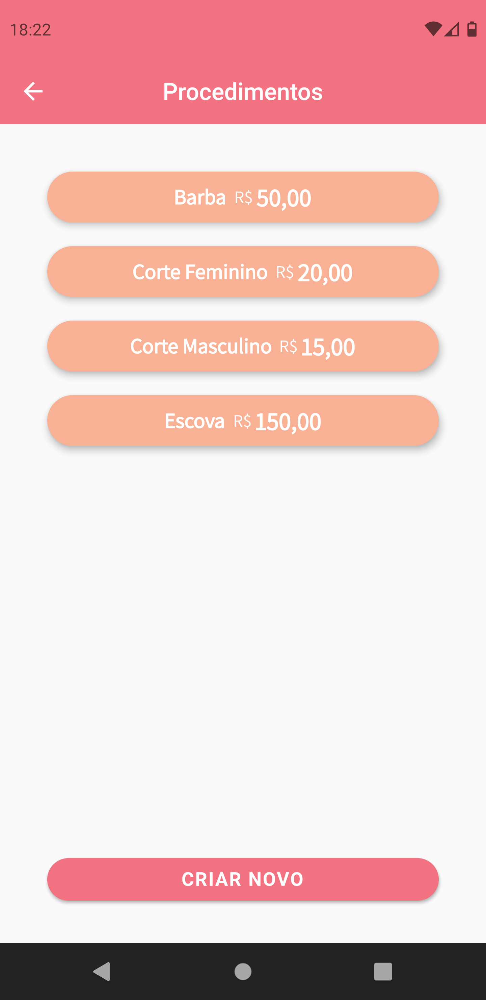

# Salon

# Sobre o Projeto
Salon é um aplicativo usado como agenda virtual de horários em um salão de beleza, onde os próprios clientes podem marcar um horário. Além disso os clientes podem também verificar os valores dos procedimentos e seu histórico. É um aplicativo simples mas extremamente útil, onde a praticidade é o que mais importa.

# Layout Usuário Comum

    

# Layout Gerenciador

    

# Objetivo
O objetivo deste projeto foi aprender melhor como utilizar o Firebase, desde a parte de autenticação até a parte de salvar imagens e outras informações. Também o conceito de se ter algo sempre sincronizado foi explorado.

# Como Utilizar?

~~~
- Clonar o repositório:
$ git clone https://github.com/murilobohlke/salon.git

- Entrar no diretório:
$ cd salon/salon

- Instalar as dependências:
$ flutter pub get

- Iniciar o app: 
$ flutter run
~~~

*Necessário também ter um projeto no Firebase, configurar ele para a plataforma e ter a chave de API.

# Tecnologias Utilizadas
- Flutter
- Provider
- Image Picker
- Firebase Firestore
- Firebase Storage
- Firebase Authentication

# Autor
Murilo Steinmetz Böhlke

